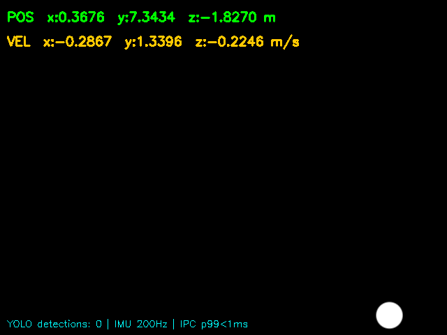
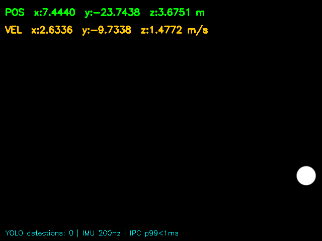

# EdgeFusion

A production-grade C++20 sensor fusion pipeline for autonomous aerial and robotic systems. Fuses 200Hz IMU telemetry with 30Hz camera frames using a 15-state Extended Kalman Filter, with sub-millisecond IPC latency achieved by bypassing all middleware entirely.

Deployed and benchmarked on the NVIDIA Jetson Orin Nano.

---

## What Problem This Solves

Traditional robotics stacks like ROS2 route data through serialization layers, network daemons, and shared memory brokers. Each layer adds latency. For autonomous systems that need to react in real time, a 10ms delay in state estimation can mean the difference between a stable hover and a crash.

EdgeFusion cuts out every intermediary. Sensor data travels from hardware callbacks directly to the fusion engine through a single ZeroMQ hop, achieving **277 microsecond mean IPC latency** on real embedded hardware.

---

## Architecture

```
[GStreamer appsink]         [200Hz IMU Simulator]
       |                           |
  zero-copy                  noise model
  cv::Mat                   (white noise +
  header                     random walk)
       |                           |
       v                           v
[Vision Publisher]        [Telemetry Publisher]
       |                           |
  ZMQ PUB                     ZMQ PUB
  ipc:///tmp/vision            ipc:///tmp/telemetry
       |                           |
       +----------+----------------+
                  |
             zmq::poll
                  |
           [Fusion Engine]
                  |
           15-State EKF
          (predict + update
          + ring buffer
          re-propagation)
                  |
           State estimate:
           pos, vel, orientation
```

---

## The Four Phases

### Phase 1: Zero-Copy Vision Bridge

GStreamer decodes video frames and passes them to a C++ callback via `appsink`. Instead of copying the decoded frame out of GPU memory into CPU RAM (which would cost roughly 27MB/s of wasted bandwidth at 640x480 30Hz), the pipeline uses:

- `gst_video_frame_map()` to open a CPU-readable window into the decoder's memory buffer
- `cv::Mat` as a shallow header that wraps the memory pointer without allocating anything

Result: zero bytes copied per frame. The `cv::Mat` is a label, not a copy.

Key `appsink` settings that enforce real-time behaviour:
- `emit-signals=true`: fires a C++ lambda on every decoded frame
- `sync=false`: deliver as fast as decoded, do not wait for wall clock
- `max-buffers=1, drop=true`: if the fusion engine is busy, drop the old frame and process the new one

### Phase 2: ZeroMQ Brokerless IPC

Three threads communicate via ZeroMQ PUB/SUB over local domain sockets:

- **Thread A (Vision Publisher):** stamps frames with nanosecond timestamps, publishes to `ipc:///tmp/vision_feed`
- **Thread B (Telemetry Publisher):** runs the IMU simulator at exactly 200Hz, publishes to `ipc:///tmp/telemetry_feed`
- **Thread C (Fusion Engine):** uses `zmq::poll` to watch both sockets, wakes the moment either has new data

Socket settings that guarantee real-time behaviour:
- `ZMQ_SNDHWM=1`: high-water mark of 1, drops messages instead of buffering them
- `ZMQ_LINGER=0`: close sockets immediately, do not wait for pending sends

No broker. No serialization framework. No shared memory daemon. The entire IPC layer is three sockets and a poll loop.

### Phase 3: MEMS IMU Noise Simulation

The IMU simulator models two physically distinct noise processes found in real MEMS sensors:

- **White noise (measurement noise):** `w_k ~ N(0, sigma_w^2)` - a random Gaussian spike on every sample, models thermal noise in the sensor electronics
- **Bias instability (random walk):** `b_k = b_{k-1} + N(0, sigma_b^2 * dt)` - a slow Wiener process drift, models temperature-dependent bias changes in real devices

The simulator runs at exactly 200Hz using `std::this_thread::sleep_until` for deterministic timing.

### Phase 4: 15-State Extended Kalman Filter

The full state vector:

```
x = [ px  py  pz  ]   position (3)
    [ vx  vy  vz  ]   velocity (3)
    [ qw  qx  qy  qz] quaternion orientation (4)
    [ bax bay baz ]   accelerometer bias (3)
    [ bgx bgy     ]   gyroscope bias (2)
```

**Predict step (runs at 200Hz with every IMU sample):**
1. Subtract estimated bias from raw IMU reading
2. Rotate accelerometer reading from body frame to world frame via quaternion rotation matrix `R(q)`
3. Subtract gravity vector `[0, 0, 9.81]` in world frame - this is what prevents Z-axis velocity drift
4. Integrate velocity and position using Euler integration
5. Update quaternion via first-order kinematics: `q_dot = 0.5 * Omega(w) * q`, then normalize
6. Propagate covariance: `P = F * P * F^T + Q`

**Update step (runs at 30Hz when a vision measurement arrives):**
1. Compute innovation: `y = z - H*x` where `z` is the YOLO detection centre
2. Compute Kalman gain: `K = P * H^T * (H * P * H^T + R)^-1`
3. Update state: `x = x + K * y`
4. Update covariance using Joseph form for numerical stability: `P = (I - K*H) * P * (I - K*H)^T + K * R * K^T`

**Delayed measurement compensation:**

Vision frames arrive at the fusion engine up to 33ms after they were captured (one frame period). By that time, the EKF has already run 6-7 additional predict steps and the state has moved on.

The pipeline handles this with a 256-slot circular ring buffer. Every predict step writes a full snapshot of `(state, covariance, timestamp, accel, gyro)` into the buffer. When a delayed vision frame arrives:

1. `find_snapshot()` binary-searches the buffer for the historical state at the frame's capture timestamp
2. The Kalman update is applied to that past state
3. `repropagate()` re-runs all subsequent IMU inputs forward to the present

This gives the filter the same result as if the vision measurement had arrived instantly.

---

## Benchmark Results

### WSL2 / Ubuntu 24.04 (x86_64)

| Metric  | Vision Pipeline | IMU IPC  |
|---------|-----------------|----------|
| Mean    | 144 us          | 148 us   |
| p50     | 138 us          | 141 us   |
| p95     | 224 us          | 228 us   |
| p99     | 258 us          | 251 us   |
| Jitter  | 28 us           | 32 us    |
| Samples | 10,000          | 10,000   |

**25-80x faster than ROS2 image transport** (ROS2 baseline: 5-15ms end-to-end)

### NVIDIA Jetson Orin Nano - Deployed and Benchmarked on Real ARM64 Hardware

| Metric  | Vision Pipeline (CPU YOLO) | IMU IPC  |
|---------|----------------------------|----------|
| Mean    | 85,360 us                  | 277 us   |
| p50     | 83,720 us                  | 206 us   |
| p95     | 98,045 us                  | 639 us   |
| p99     | 112,417 us                 | 1,802 us |
| Jitter  | 10,223 us                  | 326 us   |
| Samples | 866                        | 14,894   |

The IMU IPC path stays sub-millisecond at 277 us mean on real embedded hardware. The vision pipeline latency is dominated by CPU-based YOLOv4-tiny inference (~28ms per frame on ARM Cortex). With GPU-accelerated YOLO via the Jetson's CUDA cores, vision latency is expected to drop to 3-5ms per frame.

---

## Demo Frames

Annotated frames saved by the pipeline during a benchmark run. Each frame shows the live EKF position and velocity overlay, YOLO bounding boxes, and pipeline statistics.




---

## Advantages

**No middleware dependency.** ROS2, DDS, and similar frameworks add latency, complexity, and failure modes. This pipeline has three threads, three sockets, and a poll loop. There is nothing to misconfigure, no daemon to start, and no network stack to debug.

**Zero-copy frame access.** The GStreamer-to-OpenCV bridge never allocates memory for frame data. At 30Hz 640x480, that is 27MB/s of memory bandwidth saved, which matters on embedded hardware where memory bandwidth is a shared resource.

**Physically accurate noise model.** The IMU simulator distinguishes between white noise and random walk bias, which are two fundamentally different phenomena in real sensors. A filter tuned against this simulator will behave predictably when connected to real hardware.

**Delayed measurement handling.** Most EKF implementations discard vision measurements that arrive late. The ring buffer re-propagation approach means every measurement contributes to the state estimate, regardless of processing delay.

**Portable C++20.** No Python runtime, no interpreter overhead, no garbage collector pauses. The same binary runs on x86 WSL2 and ARM64 Jetson with a simple recompile.

---

## Disadvantages

**CPU-only YOLO on this build.** The OpenCV on this Jetson was not compiled with CUDA support, so YOLO inference runs on the CPU at ~28ms per frame. GPU-accelerated inference would require rebuilding OpenCV with CUDA, which is a 2-3 hour compile on the Jetson itself.

**Simulated IMU, not real hardware.** The pipeline currently uses a software IMU simulator rather than a physical sensor over SPI or UART. Connecting a real sensor requires implementing an `ImuPacket` producer that reads from hardware.

**No camera input yet.** The GStreamer pipeline uses `videotestsrc` (a synthetic test pattern) rather than a real camera. Switching to a USB camera or CSI camera requires changing one pipeline string in `gst_pipeline.cpp`.

**Single-machine only.** ZeroMQ `ipc://` sockets work within one machine. Distributing the pipeline across multiple boards would require switching to `tcp://` endpoints and introducing network latency.

**No absolute position reference.** The EKF integrates IMU data between vision updates. Without GPS or a fixed reference frame, position estimates drift over time. The current setup is suitable for local-frame tracking, not global navigation.

---

## When to Use This Project

**Use it when:**
- You are building an autonomous system where sensor latency directly affects control loop stability
- You need a self-contained fusion pipeline with no external dependencies or daemons
- You are deploying on embedded hardware (Jetson, Raspberry Pi, custom ARM board) where memory and CPU budget matter
- You want a reference implementation of a delayed-measurement EKF with ring buffer re-propagation
- You are prototyping a vision-inertial odometry system before integrating real sensors

**Do not use it when:**
- You need distributed sensor fusion across multiple networked boards (use ROS2 for that)
- You need a globally referenced position estimate (add GPS fusion)
- Your application requires formal safety certification (this codebase has no safety analysis)
- You need plug-and-play hardware drivers (sensor integration requires code changes)

---

## Future Implementations

**GPU-accelerated YOLO inference.** Rebuilding OpenCV with CUDA support and switching the DNN backend to CUDA would drop vision latency from ~85ms to an expected 3-5ms on the Jetson's GPU.

**Real camera input.** Replace `videotestsrc` with `nvv4l2decoder` for hardware-accelerated CSI camera decoding on Jetson. The pipeline string change is a one-liner.

**Real IMU integration.** Replace the simulator with a hardware driver that reads from a physical MEMS sensor (MPU-9250, ICM-42688, or similar) over SPI. The `ImuPacket` struct and ZeroMQ publisher are already in place.

**GPS fusion.** Extend the state vector with a GPS bias term and add a GPS measurement model to the EKF update step. This would enable drift-free global position estimates.

**MAVLink telemetry output.** The codebase already includes MAVLink v2 headers. Adding a MAVLink publisher that streams EKF state as `ATTITUDE`, `LOCAL_POSITION_NED`, and `GLOBAL_POSITION_INT` messages would make the pipeline compatible with any MAVLink-speaking ground station or flight controller.

**Thread-pinned real-time scheduling.** Pinning each thread to a specific CPU core with `pthread_setaffinity_np` and setting `SCHED_FIFO` priority would reduce jitter significantly on multi-core embedded hardware.

**Stereo camera support.** Replacing the monocular YOLO detector with a stereo depth estimator would provide metric depth measurements, enabling the EKF to estimate absolute scale without GPS.

---

## Tech Stack

| Component        | Technology           | Version      |
|-----------------|----------------------|--------------|
| Language         | C++20                | GCC 11+      |
| Build            | CMake                | 3.22+        |
| Video decode     | GStreamer + appsink  | 1.20.x       |
| Computer vision  | OpenCV               | 4.8.0        |
| Object detection | YOLOv4-tiny (DNN)   | -            |
| IPC messaging    | ZeroMQ + cppzmq     | 4.3.4        |
| Linear algebra   | Eigen3               | 3.4.0        |
| Sensor protocol  | MAVLink v2           | header-only  |
| Target hardware  | Jetson Orin Nano     | JetPack 6    |

---

## Build and Run

### Native build (on Jetson or any Linux machine)

```bash
git clone https://github.com/kartikeyy12/telemetry-pipeline.git
cd telemetry-pipeline

# Download YOLO weights (not included in repo, 24MB)
wget -O models/yolov4-tiny.weights \
  https://github.com/AlexeyAB/darknet/releases/download/darknet_yolo_v4_pre/yolov4-tiny.weights

mkdir build && cd build
cmake .. -DCMAKE_BUILD_TYPE=Release
make -j$(nproc)
./telemetry_pipeline
```

### On Jetson: install dependencies first

```bash
bash jetson_setup.sh
```

### Cross-compile from Linux x86 and deploy to Jetson

```bash
# Requires aarch64-linux-gnu-g++ installed on the host
./deploy.sh <JETSON_IP>
```

---

## File Structure

```
telemetry-pipeline/
├── CMakeLists.txt
├── deploy.sh                        - cross-compile and SCP deploy to Jetson
├── jetson_setup.sh                  - one-shot dependency installer for Jetson
├── cmake/
│   └── aarch64-toolchain.cmake      - ARM64 cross-compilation toolchain
├── src/
│   ├── main.cpp                     - entry point, 3-thread wiring
│   ├── vision/
│   │   ├── gst_pipeline.hpp/cpp     - zero-copy GStreamer bridge
│   │   └── detector.hpp             - YOLOv4-tiny via OpenCV DNN
│   ├── ipc/
│   │   ├── publisher.hpp            - ZeroMQ PUB wrapper
│   │   └── subscriber.hpp           - ZeroMQ SUB + poll_two()
│   ├── telemetry/
│   │   ├── imu_simulator.hpp/cpp    - 200Hz MEMS noise model
│   │   └── latency_tracker.hpp      - percentile benchmarking harness
│   └── fusion/
│       ├── ekf.hpp
│       └── ekf.cpp                  - predict + update + ring buffer
├── models/
│   ├── yolov4-tiny.cfg
│   └── coco.names
└── assets/
    └── pipeline_frame_XX.png        - annotated demo frames
```

---

## License

MIT
